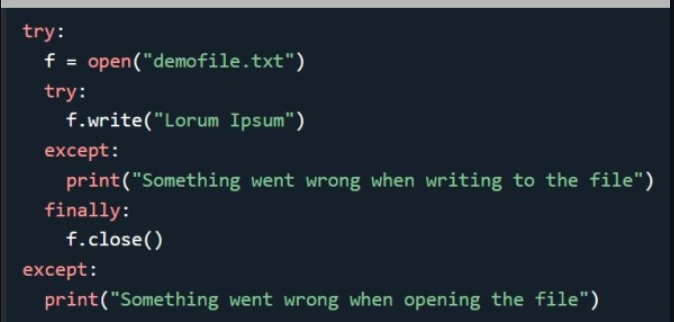
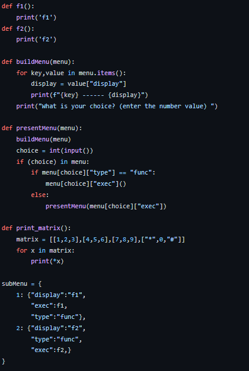


# Data Structure Project Page

    <iframe height="1000px" width="700px" src="https://replit.com/@JayManjrekar/Jay-s-Personal-Repository?lite=true%22%3E#main.py"></iframe>

### Code Snippets
Try and Except

Pirate Ship Simplified Code
~~~
#funcy.py
import time

# terminal print commands
ANSI_CLEAR_SCREEN = u"\u001B[2J"
ANSI_HOME_CURSOR = u"\u001B[0;0H\u001B[2"
OCEAN_COLOR = u"\u001B[44m\u001B[2D"
SHIP_COLOR = u"\u001B[32m\u001B[2D"
RESET_COLOR = u"\u001B[0m\u001B[2D"

def ocean_print():
    # print ocean
    print(ANSI_CLEAR_SCREEN, ANSI_HOME_CURSOR)
    print("\n\n\n\n")
    print(OCEAN_COLOR + "  " * 35)

# print ship with colors and leading spaces
def ship_print(position):
    print(ANSI_HOME_CURSOR)
    print(RESET_COLOR)
    sp = " " * position
    print(sp + "    |\   ")
    print(sp + "    |/   ")
    print(SHIP_COLOR, end="")
    print(sp + "\__ |__/ ")
    print(sp + " \____/  ")
    print(RESET_COLOR)

# ship function, iterface into this file
def ship():
    # only need to print ocean once
    ocean_print()

    # loop control variables
    start = 0  # start at zero
    distance = 60  # how many times to repeat
    step = 2  # count by 2

    # loop purpose is to animate ship sailing
    for position in range(start, distance, step):
        ship_print(position)  # call to function with parameter
        time.sleep(.1)
~~~
My Menu and Submenu

